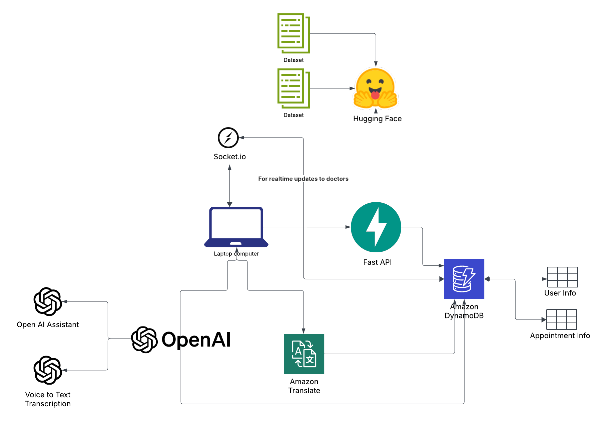
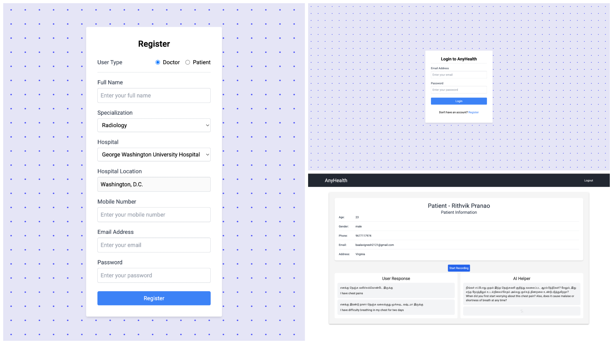
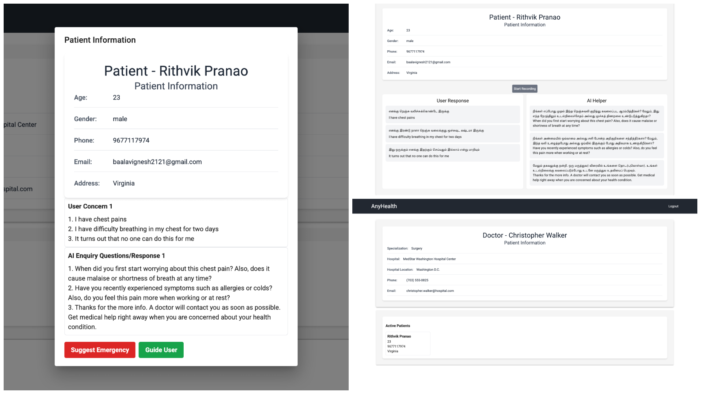

# HealthBridge AI

&#x20;


## Overview

**HealthBridge AI** is a telemedicine platform designed to bridge the language gap in healthcare. By integrating AI-driven multilingual support and cultural awareness, it enables seamless communication between patients and doctors, ensuring accessible healthcare for all.

## Features

- **AI-Powered Symptom Analysis**: Patients can record voice messages describing their symptoms, which are transcribed using OpenAI's voice-to-text technology.
- **Doctor Recommendation**: A trained Hugging Face model analyzes symptoms and recommends the appropriate doctor specialization.
- **Automated Doctor Matching**: Nearby doctors are notified in real-time (Socket.io integration in progress) with patient details and symptoms.
- **Multilingual Support**: Amazon Translate ensures communication without language barriers.
- **Future Enhancements**:
  - Real-time voice translation.
  - Direct doctor-patient calls via WebRTC.
  - Enhanced doctor availability tracking.
  - AI-driven cultural insights for better patient understanding.

## Tech Stack

- **Frontend**: React, Tailwind CSS
- **Backend**: FastAPI
- **Database**: DynamoDB
- **AI Services**: OpenAI API (Voice to Text), Hugging Face, Amazon Translate
- **Real-Time Communication**: (Socket.io - Upcoming Implementation)

## Setup Instructions

### React Frontend

```sh
npm i
npm run dev
```

Create a `.env` file in the root directory with:

```sh
VITE_OPENAI_API_KEY=
VITE_AWS_ACCESS_KEY_ID=
VITE_AWS_SECRET_ACCESS_KEY=
VITE_AWS_REGION=
VITE_ASSISTANT_ID=
```

### FastAPI Backend

```sh
pip3 install -r requirements.txt
cd app/
fastapi dev main.py
```

Create a `.env` file in the backend directory with:

```sh
OPENAI_API_KEY=
AWS_ACCESS_KEY_ID=
AWS_SECRET_ACCESS_KEY=
AWS_REGION=
DYNAMO_DB_TABLE_NAME=
```

## Screenshots





## Contributors

- **Baalavignesh Arunachalam** ([GitHub](https://github.com/Baalavignesh))
- **Rithvik Pranao** ([GitHub](https://github.com/Rithvik-007))

## Repository

[HealthBridge AI GitHub](https://github.com/Baalavignesh/HealthBridge-AI)

## License

This project is licensed under the MIT License.

